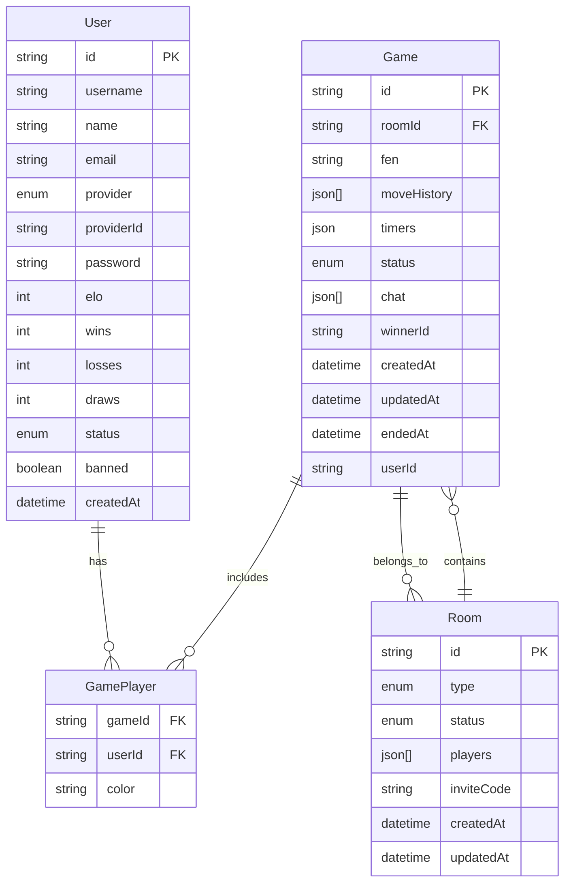
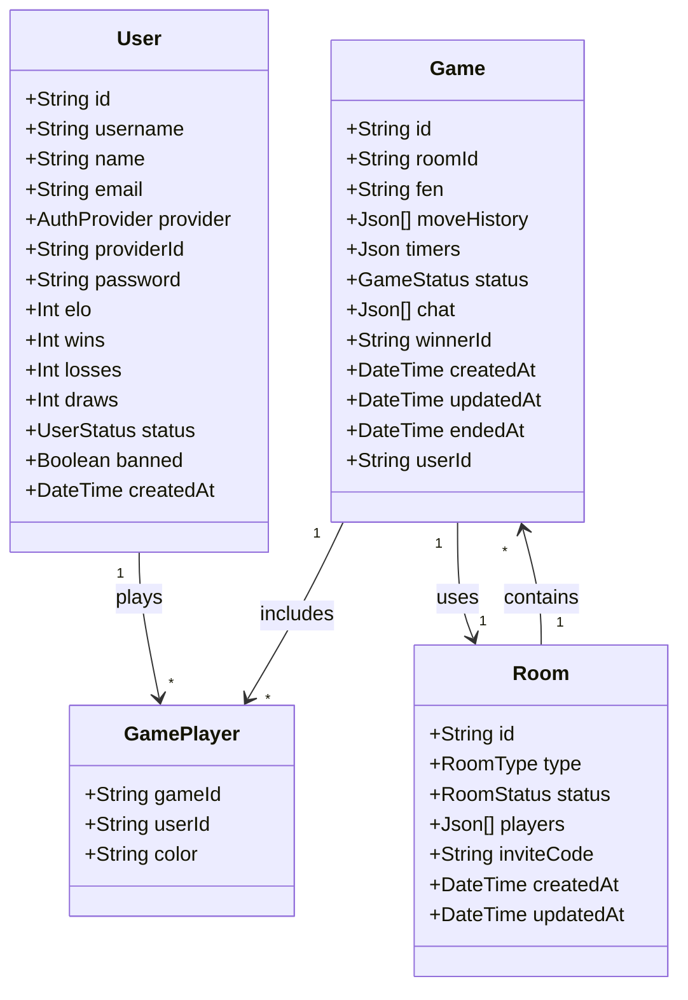

# ♟️ Chess Game – Multiplayer Chess, Rebuilt for 2025  

Because chess shouldn’t feel like a relic from 2005. This is **real-time multiplayer chess** built like a modern startup product — fast, scalable, and ridiculously smooth.  

Built with a **React frontend** and a **Node.js backend**, this app scales to thousands of players while keeping move latency under a second. Add Redis, WebSockets, and some startup-grade design flair — you’ve got chess reimagined.  

---

## ✨ Key Features  

- 🔐 **Login Like a Pro** – Guests jump in instantly, power users get Google OAuth. No friction, just play.  
- ⚡ **Moves in Milliseconds** – WebSockets keep your board synced in real time. You move, they see. Instantly.  
- 🎨 **UI That *Feels* Alive** – Tailwind + Framer Motion. Smooth, animated, responsive. Looks good everywhere.  
- 🧠 **Matchmaking on Steroids** – Redis queues + ELO logic. Always land players at your skill level.  
- 🤖 **Play vs Bot** – Don’t feel social? Warm up against the computer before you crush real opponents.  
- ♟️ **Full-Fledged Chess Brain** – En passant, castling, promotions—powered by Chess.js. No shortcuts.  
- 💬 **Trash Talk Ready** – Real-time chat with typing indicators. “gg” or talk smack, your call.  
- 🏠 **Rooms That Work for You** – Quick public games or invite-only private lobbies. Flexibility built-in.  
- 🔄 **Disconnect-Proof** – WiFi dropped? No sweat. Reconnect and pick up right where you left off.  
- 🛡️ **Fair Play Only** – Rate limiting, illegal move detection, anti-spam. No cheaters, no nonsense.  

---

## 🚀 Tech Stack  

### 🎨 Frontend  

- **Framework**: React.js 18+ with Vite (fast dev, instant HMR)  
- **Styling**: Tailwind CSS + Radix UI (accessible, modern components)  
- **State Management**: Zustand (lightweight, no boilerplate)  
- **Data Layer**: TanStack Query (React Query) for server state & caching  
- **Animations**: Framer Motion for smooth transitions  
- **Real-time Client**: Native WebSocket API  

### ⚡ Backend  

- **Core**: Node.js 18+ with TypeScript  
- **Framework**: Express.js with custom middleware  
- **Database**: PostgreSQL + Prisma ORM (type-safe, reliable)  
- **Caching & Queues**: Redis for matchmaking, sessions & active game state  
- **Real-time Server**: `ws` library powering WebSocket communication  
- **Auth**: JWT + Passport.js (Google OAuth strategy)  
- **Game Logic**: Chess.js (robust, battle-tested move validation)  

---

## 🏁 Why This Exists  

Most chess apps feel like they were built a decade ago.  
This one feels like it belongs on your 2025 home screen: **fast, social, beautiful, and scalable**.  

## 📊 System Design Diagrams

### Entity Relationship Diagram

### 🧭 Class Diagram (OOP Perspective)

