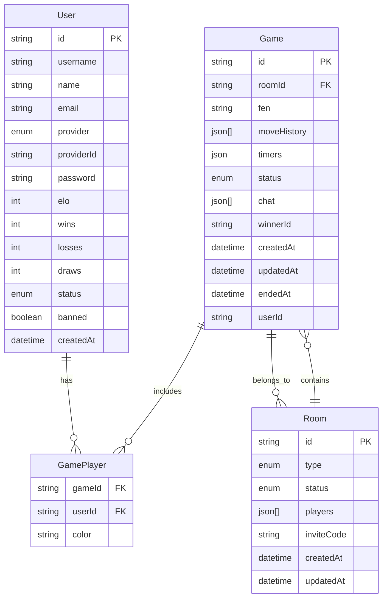
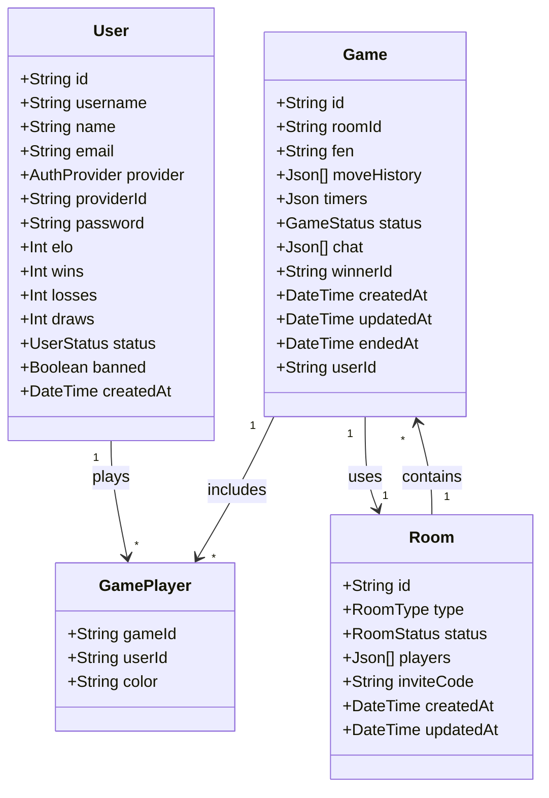

# Chess Game - Real-time Multiplayer Chess Application

A modern, full-stack, real-time multiplayer chess application built with a powerful combination of Node.js, React, PostgreSQL, and WebSocket technology. It features a comprehensive authentication system, intelligent matchmaking, and a seamless, responsive gameplay experience.

This chess application provides a complete multiplayer experience, designed from the ground up for performance and scalability. The responsive frontend built with React and the robust Node.js backend support thousands of concurrent players with sub-second move latency.

## ✨ Key Features

-   🔐 **Dual Authentication System** – Secure session-based access for guests & Google OAuth integration.
-   ⚡ **Seamless Real-time Gameplay** – WebSocket-powered instant move synchronization for a fluid experience.
-   🎨 **Responsive & Animated UI** – Modern interface built with Tailwind CSS and Framer Motion that works flawlessly on all devices.
-   🧠 **Smart Matchmaking** – **Redis-powered queues** for pairing players based on ELO rating.
-   ♟️ **Complete Chess Engine** – Full rule validation including *en passant*, castling, and promotions via Chess.js.
-   💬 **In-Game Chat** – Real-time messaging between players with typing indicators.
-   🏠 **Flexible Room System** – Public rooms for quick matches and private, invite-only rooms for friends.
-   🔄 **Robust Reconnection Handling** – Seamless game continuity after network disconnections.
-   🛡️ **Anti-abuse Protection** – Backend rate limiting and illegal move detection to ensure fair play.

## 🚀 Tech Stack

### Frontend

-   **Core Framework**: **React.js 18+** with Vite
-   **Styling**: **Tailwind CSS** with Radix UI for accessible components
-   **State Management**: **Zustand** for simple, centralized global state
-   **Data Fetching & Caching**: **TanStack Query (React Query)** for server state management
-   **Animations**: **Framer Motion** for fluid UI transitions and animations
-   **Real-time Client**: Native WebSocket API for live communication

### Backend

-   **Core**: **Node.js 18+** with TypeScript
-   **API Framework**: **Express.js** with comprehensive middleware
-   **Database**: **PostgreSQL** with **Prisma ORM** for type-safe database access
-   **In-Memory Caching & Queues**: **Redis** for high-performance caching of active game state, session management, and powering the real-time matchmaking queues.
-   **Real-time Server**: **`ws` library** for a high-performance WebSocket server
-   **Authentication**: **JWT** with **Passport.js** for Google OAuth strategy
-   **Game Logic**: **Chess.js** for robust move validation

## 📊 System Design Diagrams

### Entity Relationship Diagram

### 🧭 Class Diagram (OOP Perspective)

